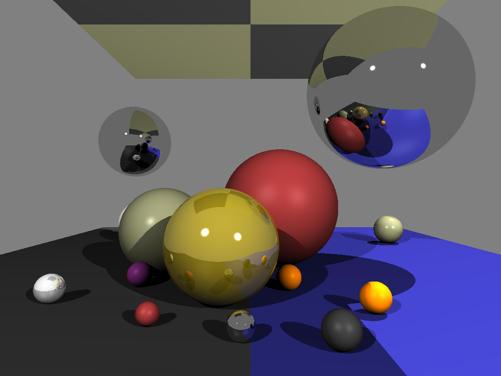

# simpleTracer

simpleTracer is a Ray Tracer written in C++.

**How to run:**
~~~
~[..]/simpleTracer$ g++ src/main.cpp
~[..]/simpleTracer$ ./a.out
~~~

## TODO
 * [X] Spheres
 * [X] Lighting & shadow
 * [X] Simple materials
 * [X] Planes
 * [ ] Antialiasing
 * [ ] Depth of field
 * [ ] .jpg and .png support
 * [ ] Triangle meshes
 * [ ] Surface textures
 
## Resources
 * [Understandable RayTracing](https://github.com/ssloy/tinyraytracer/wiki/Part-1:-understandable-raytracing)
 * [Lighthouse3d Math](www.lighthouse3d.com/tutorials/maths/)